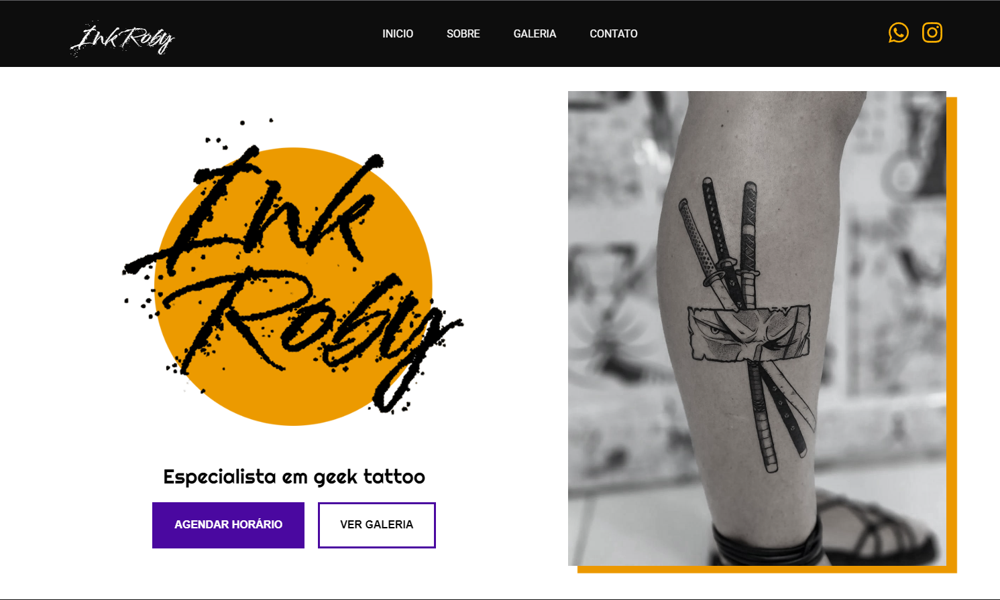
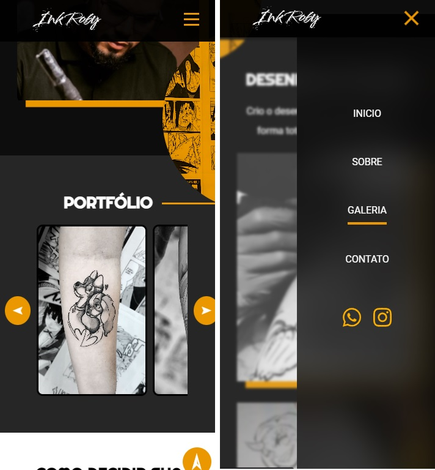

# Landing-page-Tattoo

 

## 🔗 Links

- [Live Version for project](https://barbaradamasdev.github.io/Landing-page-Tattoo/)
- [Active Version](https://inkroby.com/)

## 😄 Olá

Esse foi meu primeiro projeto freelancer real. Utilizei conhecimentos de HTML, CSS e Javascript para criar um portfolio de tatuagem. Foquei no site final:
- Layout responsivo, mobile first
- Galeria com scroll horizontal
- Animações no menu hamburguer
- Flexbox e grid display

## 💾 Linguagens utilizadas

- HTML
- CSS
- JavaScript

 

## 🐼 Autora

Bárbara Damasceno - barbaradamas.dev@gmail.com
